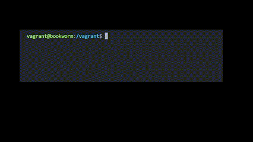

[](https://classroom.github.com/a/tp86o73G)
[](https://classroom.github.com/open-in-codespaces?assignment_repo_id=17729752)

# MAC Address Changer

This MAC Address changer Bash script safely changes your network interface's MAC address while preserving the original address for future reference. The script generates a random MAC address and handles the entire process of bringing the interface down, changing the address, and bringing it back up.

## Features and Key Benefits

- Automatically detects the primary network interface
- Generates cryptographically sound random MAC addresses
- Preserves the original MAC address in a separate file
- Includes comprehensive error handling and validation
- Requires minimal user intervention
- Maintains network security best practices

## Installation Instructions and Dependencies

### Prerequisites
- Linux-based operating system
- Root/sudo privileges
- Basic command line knowledge
- `ip` command (usually pre-installed on most Linux distributions)

### Installation Steps
1. Clone the repository:
```bash
git clone https://github.com/WTCSC/mac-address-changer-brodyBroughton.git
cd mac-address-changer-brodyBroughton
```

2. Make the script executable:
```bash
chmod +x macncheese.sh
```

## Usage Examples with Command-line Arguments

Basic usage:
```bash
sudo ./macncheese.sh
```

Check current MAC address:
```bash
ip link show
```

View original MAC address:
```bash
cat ogmacaddress.txt
```

## Error Handling and Validation

The script includes comprehensive error handling for common scenarios:

1. Interface Detection:
```bash
if [[ -z "$interface" ]]; then
    echo "Error: Could not detect network interface"
    exit 1
fi
```

2. MAC Address Validation:
```bash
if ! [[ $random_mac =~ ^([0-9A-Fa-f]{2}:){5}[0-9A-Fa-f]{2}$ ]]; then
    echo "Error: Invalid MAC address generated"
    exit 1
fi
```

3. Network Interface Operations:
```bash
if ! sudo ip link set dev $interface down; then
    echo "Error: Failed to bring interface down"
    exit 1
fi
```

## Common Troubleshooting Tips

1. Permission Issues
   - Error: "Permission denied"
   - Solution: Ensure you're running with sudo privileges
   ```bash
   sudo chmod +x macncheese.sh
   ```

2. Interface Not Found
   - Error: "Could not detect network interface"
   - Solution: List available interfaces and verify network connection
   ```bash
   ip link show
   ```

3. MAC Address Change Failed
   - Error: "Failed to change MAC address"
   - Solution: Verify no other processes are using the interface
   ```bash
   sudo lsof -i
   ```

## Script Demonstration

Here's what happens when you run the script:

1. Initial Check:
```bash
$ sudo ./macncheese.sh
Original MAC address can be found in ogmacaddress.txt
```

2. Process Output:
```bash
Network interface: wlan0
MAC address changed to: 02:45:78:9A:BC:DE
```

3. Check Original MAC Address (optional):
```bash
$ cat ogmacaddress.txt
```




## Security Considerations

- Always backup your original MAC address (automatically done by the script)
- Use with caution on production systems
- May need to reconfigure network settings after MAC change
- Some networks may block devices with changed MAC addresses

## Project Structure
```
mac-changer/
├── macncheese.sh          # Main script
├── ogmacaddress.txt        # Original MAC address backup
└── README.md              # This file
```

## Script Components

### MAC Address Detection:
```bash
original_mac=$(ip link show | awk -F'ether ' '/ether/ {print $2}' | head -n1)
```

### Interface Detection:
```bash
interface=$(ip link show | awk -F': ' '/^[0-9]+/ {print $2}' | grep -v 'lo' | head -n1)
```

### Random MAC Generation:
```bash
random_mac=$(printf '02:%02x:%02x:%02x:%02x:%02x' $((RANDOM%256)) ...)
```

### Exit Codes
- 0: Success
- 1: General error (interface not found, invalid MAC, etc.)